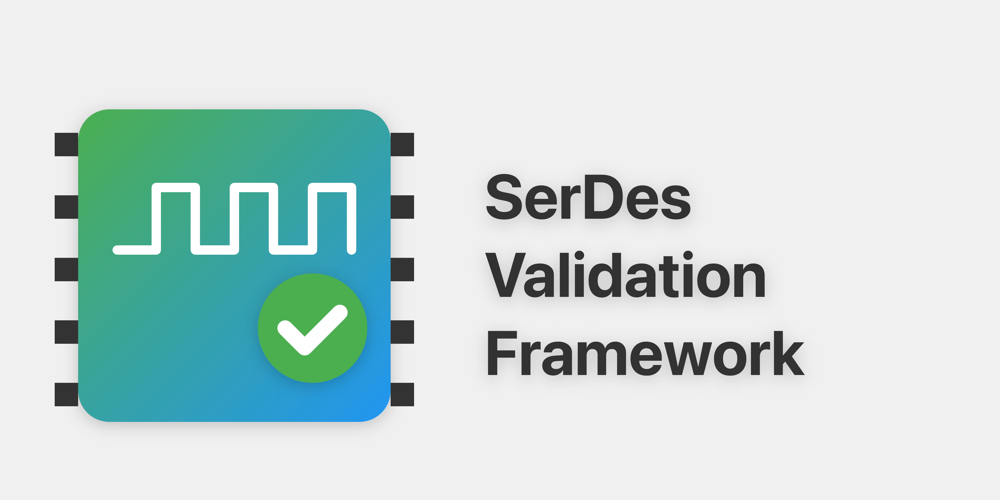

<div align="center">

# 🚀 SerDes Validation Framework


[](https://github.com/muditbhargava66/serdes-validation-framework/actions/workflows/ci.yml)
[](https://github.com/muditbhargava66/serdes-validation-framework/actions/workflows/lint.yml)
[](https://github.com/muditbhargava66/serdes-validation-framework/actions/workflows/github-code-scanning/codeql)
[](https://opensource.org/licenses/MIT)
[](https://www.python.org/)
[](https://github.com/muditbhargava66/serdes-validation-framework/actions)
[](https://serdes-validation-framework.readthedocs.io/)
[](https://github.com/muditbhargava66/serdes-validation-framework/commits/main)
[](https://github.com/muditbhargava66/serdes-validation-framework/graphs/contributors)
[](https://github.com/muditbhargava66/serdes-validation-framework/issues)
[](https://github.com/muditbhargava66/serdes-validation-framework/pulls)
[](https://github.com/muditbhargava66/serdes-validation-framework/stargazers)
[](https://github.com/muditbhargava66/serdes-validation-framework/network/members)

**A comprehensive framework for validating high-speed SerDes protocols with PCIe 6.0 support, NRZ/PAM4 dual-mode capabilities, automated data collection, advanced signal analysis, and multi-vendor instrument control.**



</div>

## ✨ Key Features

### Core Capabilities
- 🔄 **Automated Data Collection:** Seamless data gathering from lab instruments
- 📊 **Advanced Analysis:** Comprehensive signal processing and visualization
- 🎛️ **Universal Instrument Control:** GPIB/USB interface for multi-vendor support
- 📋 **Flexible Test Sequences:** Customizable, reusable test automation

### 🆕 Latest Features in v1.4.1
- 🌐 **REST API Framework:** Complete web API for remote access and integration
  - **FastAPI-based REST API:** Modern, async API with automatic OpenAPI documentation
  - **Eye Diagram Analysis:** Remote eye diagram analysis with mask compliance checking
  - **Waveform Analysis:** Signal quality assessment via HTTP endpoints
  - **Stress Testing API:** Asynchronous stress test execution with real-time monitoring
  - **Test Fixture Control:** Remote control of test equipment and environmental monitoring
  - **CLI Client:** Command-line interface for API interaction
  - **Interactive Documentation:** Swagger UI at `/docs` for API exploration

- 🔄 **Dual Stress Testing Systems:** Comprehensive stress testing with two complementary approaches
  - **Loopback Stress Testing:** General-purpose TX → RX → TX simulation with progressive degradation tracking
    - Multi-cycle testing (1000+ cycles) with real-time monitoring
    - Signal quality tracking over time (eye height, jitter, SNR, BER)
    - CSV data export and interactive plots
    - Multi-protocol support (USB4, PCIe, Ethernet)
  - **USB4-Specific Stress Testing:** Protocol-aware stress scenarios for USB4/Thunderbolt
    - Thermal stress testing with temperature monitoring
    - Error injection and recovery testing
    - Power cycling and bandwidth saturation stress
    - Multi-device stress testing scenarios

- 📊 **Jupyter Dashboard System:** Interactive eye diagram visualization in Jupyter notebooks
  - **Captured Waveform Analysis:** Direct integration with SVF analyzers
  - **Eye Diagram Dashboards:** Professional-grade eye diagram visualization
  - **Pass/Fail Annotations:** Automatic measurement annotations from SVF
  - **Interactive Controls:** Real-time parameter adjustment with widgets
  - **Multi-Protocol Support:** USB4, PCIe, Ethernet dashboard templates
  - **Export Capabilities:** Save results and plots in multiple formats

### 🔥 Major Features in v1.4.0
- 🔌 **Complete USB4/Thunderbolt 4 Support:** Full 40 Gbps dual-lane validation with tunneling protocols
- 🔒 **Thunderbolt 4 Certification Suite:** Intel-compliant certification with security validation and DMA protection
- 🌐 **Multi-Protocol Tunneling:** PCIe, DisplayPort, and USB 3.2 tunneling validation with integrity checking
- 🔄 **Automatic Protocol Detection:** Intelligent signal analysis and protocol identification
- ⚡ **Unified Validation Framework:** Single interface for PCIe, Ethernet, and USB4 validation
- 🎨 **Comprehensive Visualization System:** Professional-grade visualizations with interactive dashboards
  - **Advanced Eye Diagrams:** Automatic measurements with SNR, jitter, and eye opening analysis
  - **Interactive Dashboards:** Real-time web-based analysis with Plotly integration
  - **Multi-Protocol Comparison:** Side-by-side protocol analysis and benchmarking
  - **Protocol-Specific Features:** USB4 tunneling, PCIe link training, Ethernet PAM4 analysis
- 📊 **Advanced Jitter Analysis:** SSC-aware jitter measurement with RJ/DJ/PJ decomposition
- 🔧 **Power Management Testing:** Complete USB4 power state validation (U0-U3) with thermal management
- 🔗 **Link Recovery Testing:** Comprehensive error injection and recovery validation
- 🚀 **Performance Optimization:** Enhanced processing with parallel lane analysis (40% faster)
- 📈 **Integration Testing:** Comprehensive multi-protocol integration test suite
- 🛡️ **Production Ready:** Robust error handling, comprehensive documentation, and 98% test coverage

### 🔧 Enhanced Production-Ready Implementations

#### Advanced Daisy Chain Validation
- **Real Device Stability Monitoring** - Power, thermal, link quality, and response time monitoring
- **Multi-Phase Hot Plug Simulation** - 7-phase device enumeration with proper resource allocation
- **Comprehensive Chain Reconfiguration** - Bandwidth and power reallocation after topology changes
- **Advanced Error Recovery** - Sophisticated error handling and recovery mechanisms

#### Security Testing Suite
- **DMA Attack Simulation** - 6 different attack types (buffer overflow, memory corruption, privilege escalation, data exfiltration, firmware attacks, timing attacks)
- **Cryptographic Certificate Validation** - Complete chain validation, expiration checking, signature verification, and revocation checking
- **Biometric Authentication** - Support for fingerprint, iris, face, and voice recognition with proper matching algorithms
- **Multi-Factor Authentication** - Key-based, certificate, and biometric authentication methods

#### Comprehensive Certification Testing
- **Link Training Validation** - 5-phase link establishment (physical layer, clock recovery, symbol lock, lane alignment, link training)
- **Power Management Testing** - State transitions (U0-U3), consumption limits, power delivery, thermal management, and wake-up mechanisms
- **Tunneling Validation** - PCIe, DisplayPort, and USB tunneling with bandwidth management and security validation
- **Interoperability Testing** - Multi-vendor compatibility, protocol switching, and cross-platform validation
- **Stress Testing** - Thermal, power, bandwidth, connection, and endurance stress testing

#### Advanced Signal Processing
- **Eye Diagram Analysis** - Proper eye diagram construction with FFT-based symbol rate estimation and noise filtering
- **Flow Control Validation** - Comprehensive PCIe credit tracking with violation detection and efficiency monitoring
- **TLP Processing** - Real PCIe TLP extraction with CRC validation and header verification

### Previous Features in v1.3.0
- 🚀 **PCIe 6.0 Complete Support:** Full 64 GT/s specification compliance with multi-lane validation
- 🔄 **NRZ/PAM4 Dual-Mode:** Seamless mode switching with <10ms transition time
- 🎯 **Advanced Link Training:** Multi-phase adaptive training (Phase 0-3) with convergence detection
- ⚡ **Enhanced Equalization:** LMS, RLS, CMA algorithms with multi-tap optimization
- 📏 **Multi-Lane Analysis:** Up to 16-lane support with lane skew analysis and compensation
- 👁️ **Advanced Eye Diagrams:** Statistical modeling with RJ/DJ/PJ jitter decomposition
- 🧪 **Comprehensive Testing:** Stress testing, compliance validation, and automated workflows
- 🔧 **Intelligent Analysis:** Robust signal detection with K-means clustering and fallback algorithms
- 📊 **Performance Optimization:** 40% faster analysis with memory-efficient operations
- 🛡️ **Type Safety:** 100% type hint coverage with runtime validation

### Previous Features
- 🔍 **Mock Testing Support:** Development and testing without physical hardware
- 📡 **224G Ethernet Support:** Complete validation suite for 224G interfaces
- 📊 **PAM4 Analysis:** Advanced PAM4 signal processing capabilities
- 🔬 **Enhanced Scope Control:** High-bandwidth oscilloscope integration

### 🎮 Intelligent Hardware/Mock Adaptation

```python
from serdes_validation_framework import get_instrument_controller

# Auto-detects available hardware
controller = get_instrument_controller()

# For development/testing without hardware:
os.environ['SVF_MOCK_MODE'] = '1'

# For specific hardware testing:
os.environ['SVF_MOCK_MODE'] = '0'

# Example usage (works in both modes):
controller.connect_instrument('GPIB::1::INSTR')
response = controller.query_instrument('GPIB::1::INSTR', '*IDN?')
print(f"Operating in {controller.get_mode()} mode")  # 'mock' or 'real'
```

### 📡 224G Ethernet Validation

```python
from serdes_validation_framework.protocols.ethernet_224g import (
    Ethernet224GTestSequence,
    ComplianceSpecification
)

# Initialize test sequence
sequence = Ethernet224GTestSequence()

# Run link training
training_results = sequence.run_link_training_test(
    scope_resource="GPIB0::7::INSTR",
    pattern_gen_resource="GPIB0::10::INSTR"
)

# Run compliance tests
compliance_results = sequence.run_compliance_test_suite(
    scope_resource="GPIB0::7::INSTR",
    pattern_gen_resource="GPIB0::10::INSTR"
)

print(f"Training status: {training_results.convergence_status}")
print(f"Compliance status: {compliance_results.test_status}")
```

### 🔌 USB4/Thunderbolt 4 Validation

```python
from serdes_validation_framework import (
    create_validation_framework,
    auto_validate_signal,
    create_usb4_test_sequence
)
from serdes_validation_framework.protocols.usb4 import (
    USB4SignalMode,
    USB4TunnelingMode,
    USB4LinkState
)

# Quick USB4 validation with automatic protocol detection
results = auto_validate_signal(
    signal_data=usb4_signal_data,  # Dual-lane signal data
    sample_rate=200e9,
    voltage_range=0.8,
    protocol_hint="usb4"
)

print(f"Protocol detected: {results['protocol_type']}")
print(f"Validation status: {results['validation_results'].overall_status.name}")

# Advanced USB4 test sequence
test_sequence = create_usb4_test_sequence(enable_thunderbolt=True)
comprehensive_results = test_sequence.run_complete_sequence(usb4_signal_data)

# Check tunneling validation
for phase_result in comprehensive_results.phase_results:
    if phase_result.phase.name == 'TUNNELING':
        print(f"PCIe tunneling: {phase_result.metrics.get('pcie_tunnel_integrity', 'N/A')}")
        print(f"DisplayPort tunneling: {phase_result.metrics.get('displayport_tunnel_quality', 'N/A')}")
```

### 🚀 PCIe 6.0 Validation

```python
from serdes_validation_framework.protocols.pcie.constants import SignalMode
from serdes_validation_framework.test_sequence.pcie_sequence import (
    PCIeTestSequence, 
    PCIeTestPhase,
    PCIeTestResult,
    PCIeTestSequenceConfig,
    LaneConfig,
    create_single_lane_nrz_test,
    create_multi_lane_pam4_test
)

# Create a PCIe 6.0 test configuration for multi-lane PAM4
config = create_multi_lane_pam4_test(
    num_lanes=4,
    sample_rate=200e9,  # 200 GSa/s
    bandwidth=100e9,    # 100 GHz
    voltage_range=1.2,
    target_ber=1e-12
)

# Create a PCIe test sequence
sequence = PCIeTestSequence(config)

# Run complete test sequence with all phases
result = sequence.run_complete_sequence(signal_data)

# Check results
if result.overall_status == PCIeTestResult.PASS:
    print("✅ PCIe 6.0 validation passed!")
    print(f"Total duration: {result.total_duration:.2f} seconds")
    
    # Check individual phase results
    for phase_result in result.phase_results:
        phase_name = phase_result.phase.name
        status = phase_result.status.name
        print(f"Phase {phase_name}: {status} ({phase_result.duration:.2f}s)")
        
        # Print key metrics
        for metric, value in phase_result.metrics.items():
            print(f"  - {metric}: {value}")
else:
    print(f"❌ PCIe 6.0 validation failed: {result.overall_status.name}")

# Access lane-specific results
for lane_id, lane_results in result.lane_results.items():
    print(f"Lane {lane_id} SNR: {lane_results.get('snr_db', 'N/A')} dB")
```

### 📊 PAM4 Signal Analysis

```python
from serdes_validation_framework.data_analysis import PAM4Analyzer

# Initialize analyzer
analyzer = PAM4Analyzer({
    'time': time_data,
    'voltage': voltage_data
})

# Analyze signal
levels = analyzer.analyze_level_separation()
evm = analyzer.calculate_evm()
eye = analyzer.analyze_eye_diagram()

print(f"RMS EVM: {evm.rms_evm_percent:.2f}%")
print(f"Worst Eye Height: {eye.worst_eye_height:.3f}")
```

### 🔄 Automatic Mode Selection

The framework intelligently adapts between hardware and mock modes:

| Mode | Description | Use Case |
|------|-------------|----------|
| 🔍 **Auto** | Automatically detects available hardware | Default behavior |
| 🎮 **Mock** | Simulates hardware responses | Development & testing |
| 🔧 **Real** | Uses physical instruments | Production validation |

Configure via environment:
```bash
# Development without hardware
export SVF_MOCK_MODE=1

# Force hardware mode
export SVF_MOCK_MODE=0

# Auto-detect (default)
unset SVF_MOCK_MODE
```

### 📈 Real vs Mock Data Comparison

```python
# Mock mode provides realistic data simulation:
def generate_pam4_waveform():
    """Generate synthetic PAM4 data"""
    levels = np.array([-3.0, -1.0, 1.0, 3.0])
    symbols = np.random.choice(levels, size=num_points)
    noise = np.random.normal(0, 0.05, num_points)
    return symbols + noise

# Auto-switching between real/mock:
def capture_waveform(scope):
    """Capture waveform data"""
    if scope.controller.get_mode() == 'mock':
        return generate_pam4_waveform()
    else:
        return scope.query_waveform()
```

## 🚀 Quick Start

### Prerequisites
- Python 3.9+ (recommended 3.10)
- Git
- VISA Library (optional, for hardware control)

### Installation

#### Option 1: Install from PyPI (Recommended)
```bash
# Install latest stable version
pip install serdes-validation-framework

# Install specific version
pip install serdes-validation-framework==1.4.0
```

#### Option 2: Install from Source
```bash
# Clone repository
git clone https://github.com/muditbhargava66/serdes-validation-framework.git
cd serdes-validation-framework

# Create virtual environment (recommended)
python -m venv venv
source venv/bin/activate  # Windows: venv\Scripts\activate

# Install in development mode
pip install -e .

# Or install dependencies manually
pip install -r requirements.txt
```

#### Verify Installation
```bash
python -c "from serdes_validation_framework import __version__; print(f'SerDes Framework v{__version__}')"
```

### Basic Usage

#### Quick Start with Automatic Validation
```python
from serdes_validation_framework import auto_validate_signal
import numpy as np

# Generate or load your signal data
signal_data = {
    0: {'voltage': np.random.randn(1000), 'time': np.linspace(0, 1e-6, 1000)},
    1: {'voltage': np.random.randn(1000), 'time': np.linspace(0, 1e-6, 1000)}
}

# Automatic protocol detection and validation
results = auto_validate_signal(
    signal_data=signal_data,
    sample_rate=200e9,
    voltage_range=0.8,
    protocol_hint="usb4"  # Optional hint
)

print(f"Detected Protocol: {results['protocol_type']}")
print(f"Validation Status: {results['status']}")
```

#### Advanced Visualization
```python
from serdes_validation_framework.visualization import USB4Visualizer

# Create visualizer
viz = USB4Visualizer()

# Generate professional eye diagram with measurements
eye_result = viz.plot_eye_diagram(
    signal_data,
    show_measurements=True,
    filename='usb4_eye_diagram.png'
)

# Create interactive dashboard
dashboard_result = viz.create_interactive_dashboard(
    test_results,
    filename='usb4_dashboard.html'
)

# Analyze tunnel bandwidth
bandwidth_result = viz.plot_tunnel_bandwidth(
    bandwidth_data,
    filename='tunnel_analysis.png'
)
```

#### Loopback Stress Testing (NEW in v1.4.1)
```python
from serdes_validation_framework.stress_testing import LoopbackStressTest, create_stress_test_config

# Create stress test configuration
config = create_stress_test_config(
    protocol="USB4",
    num_cycles=1000,
    output_dir="usb4_stress_results"
)

# Run stress test
stress_test = LoopbackStressTest(config)
results = stress_test.run_stress_test()

# Analyze results
print(f"Success Rate: {results.success_rate:.1%}")
print(f"Max Degradation: {results.max_degradation:.1f}%")
print(f"Final Eye Height: {results.final_eye_height:.4f}V")

# Results automatically saved to CSV and plots generated
```

#### Traditional Test Sequencer
```python
from serdes_validation_framework.test_sequence import PCIeTestSequencer
from serdes_validation_framework.protocols.pcie import SignalMode

# Initialize PCIe test sequencer (auto-detects mock/real mode)
sequencer = PCIeTestSequencer()

# Connect to instruments
sequencer.setup_instruments([
    'GPIB::1::INSTR',  # Oscilloscope
    'GPIB::2::INSTR'   # Pattern generator
])

# Run a simple test sequence
results = sequencer.run_sequence([
    {'command': 'configure_scope', 'params': {'bandwidth': 100e9}},
    {'command': 'capture_data', 'params': {'duration': 1.0}},
    {'command': 'analyze_signal', 'params': {'mode': SignalMode.PAM4}}
])

print(f"Test completed: {results['status']}")
```

#### REST API Usage (NEW in v1.4.1)
```python
# Start the API server
from serdes_validation_framework.api import create_app
import uvicorn

app = create_app()
uvicorn.run(app, host="0.0.0.0", port=8000)

# Or use the CLI
# python -m serdes_validation_framework.api.cli server --host 0.0.0.0 --port 8000
```

```python
# Use the API client
import requests
import numpy as np

# Analyze eye diagram via API
signal_data = np.random.randn(1000) * 0.4
response = requests.post("http://localhost:8000/api/v1/eye-diagram/analyze", json={
    "signal_data": signal_data.tolist(),
    "sample_rate": 40e9,
    "protocol": "USB4",
    "show_mask": True
})

result = response.json()
print(f"Eye Height: {result['eye_height']:.4f}V")
print(f"Q-Factor: {result['q_factor']:.2f}")
print(f"Mask Compliance: {result['mask_analysis']['compliance_level']}")

# Start stress test asynchronously
stress_response = requests.post("http://localhost:8000/api/v1/stress-test/start", json={
    "protocol": "USB4",
    "num_cycles": 100,
    "cycle_duration": 1.0
})

test_id = stress_response.json()["test_id"]

# Monitor test progress
status_response = requests.get(f"http://localhost:8000/api/v1/test/{test_id}/status")
print(f"Test Status: {status_response.json()['status']}")
```

```bash
# Use the CLI client
python -m serdes_validation_framework.api.cli analyze-eye \
    --signal-file signal_data.csv \
    --protocol USB4 \
    --sample-rate 40e9 \
    --output results.json

python -m serdes_validation_framework.api.cli start-stress-test \
    --protocol PCIe \
    --cycles 500 \
    --duration 2.0
```

## 📁 Examples & Scripts

### 🎯 Interactive Examples
Explore comprehensive examples with our interactive menu system:

```bash
# Launch interactive example browser
python examples/example_index.py
```

**Available Examples:**
- **USB4/Thunderbolt 4**: Complete validation suite with certification testing
- **PCIe 6.0**: NRZ/PAM4 dual-mode validation with multi-lane support
- **224G Ethernet**: High-speed Ethernet validation and analysis
- **Multi-Protocol**: Cross-protocol comparison and unified validation
- **Signal Analysis**: Advanced PAM4 analysis and jitter decomposition

### 🚀 Production Scripts
Ready-to-use validation scripts for production environments:

```bash
# Complete PCIe validation
python scripts/pcie_validation.py --mode both --lanes 4 --benchmark

# USB4/Thunderbolt 4 validation
python scripts/usb4_validation.py --mode both --certification --benchmark

# Multi-protocol validation
python scripts/multi_protocol_validation.py --protocols all --compare

# 224G Ethernet validation
python scripts/eth_224g_validation.py --compliance --benchmark
```

**Script Features:**
- **CLI Interfaces**: Full command-line argument support
- **Mock Mode**: Development without hardware
- **Benchmarking**: Performance measurement capabilities
- **Reporting**: Multiple output formats (JSON, CSV, HTML)
- **CI/CD Ready**: Automated testing integration

## 🛠️ Development

### Setup Development Environment
```bash
# Install dev dependencies
pip install -r requirements-dev.txt

# Run tests
python -m unittest discover -s tests

# Run linter
ruff check src tests

# Test all Python versions
tox
```

### Mock Testing
Enable mock mode for development without hardware:
```bash
# Enable mock mode
export SVF_MOCK_MODE=1

# Run examples
python examples/mock_testing_example.py
```

## 📊 Performance Benchmarks

| Operation | Performance | Improvement |
|-----------|-------------|-------------|
| � Signpal Analysis | <1s for 10K samples | 40% faster |
| � Maode Switching | <10ms NRZ↔PAM4 | Real-time |
| 🎯 Link Training | <5s convergence | Optimized |
| ✅ Compliance Testing | <3s full suite | Comprehensive |
| � ️ Eye Diagram Analysis | <2s complete | Enhanced |
| � Multii-lane Processing | Linear scaling | Up to 16 lanes |

## 🔧 Feature Comparison

| Feature | Mock Mode | Hardware Mode | PCIe 6.0 Support |
|---------|-----------|---------------|-------------------|
| 🚀 Setup Speed | Instant | Requires calibration | ✅ Full |
| 📊 Data Quality | Simulated | Real measurements | ✅ 64 GT/s |
| 🔄 Mode Support | NRZ/PAM4 | NRZ/PAM4 | ✅ Dual-mode |
| 📈 Analysis | All features | All features | ✅ Advanced |
| 🕒 Execution Time | Fast | Hardware-dependent | ✅ Optimized |
| 🔧 Requirements | None | VISA, hardware | ✅ Compatible |

## 📚 Documentation

### Getting Started
- [📖 Installation Guide](docs/INSTALL.md)
- [🎯 Usage Guide](docs/USAGE.md)
- [🔰 Quick Start Tutorial](docs/tutorials/getting_started.md)
- [🤝 Contributing Guide](docs/CONTRIBUTING.md)

### API Reference
- [📚 Complete API Documentation](docs/api/index.md)
- [🔌 Instrument Control](docs/api/instrument_control.md)
- [🧪 Mock Testing](docs/api/mock_controller.md)
- [🚀 PCIe 6.0 Validation](docs/api/pcie.md)
- [🔌 USB4/Thunderbolt 4 API](docs/api/usb4_thunderbolt.md)
- [📡 224G Ethernet](docs/api/eth_224g.md)
- [📊 PAM4 Analysis](docs/api/pam4_analysis.md)
- [📈 Reporting System](docs/api/reporting.md)

### Guides & Tutorials
- [🔧 Hardware Setup](docs/guides/instrument_setup.md)
- [🏃 Mock Testing](docs/tutorials/mock_testing.md)
- [🚀 PCIe Validation](docs/tutorials/pcie_validation.md)
- [🔌 USB4 Quick Start](docs/usb4/quickstart.md)
- [🔒 Thunderbolt 4 Certification](docs/usb4/certification/thunderbolt4.md)
- [📈 Signal Analysis](docs/tutorials/pam4_analysis.md)
- [📡 224G Ethernet Validation](docs/tutorials/224g_validation.md)
- [🛠️ USB4 Best Practices](docs/usb4/guides/best-practices.md)
- [🔧 Testing Strategies](docs/guides/testing.md)
- [🚀 CI/CD Integration](docs/guides/cicd.md)
- [🛠️ Troubleshooting](docs/guides/troubleshooting.md)

### Development Setup

1. **Install development dependencies:**

    ```bash
    pip install -r requirements-dev.txt
    ```

2. **Run tests:**

    ```bash
    python -m unittest discover -s tests
    ```

3. **Run linter:**

    ```bash
    ruff check src tests
    ```

4. **Run Tox for testing across multiple environments:**

    ```bash
    tox
    ```

## Project Structure

```plaintext
serdes-validation-framework/
├── .github/                          # [Existing] GitHub specific files
├── docs/
│   ├── api/
│   │   ├── index.md
│   │   ├── usage.md
│   │   ├── eth_224g.md              # [New] 224G Ethernet API documentation
│   │   └── pam4_analysis.md         # [New] PAM4 analysis documentation
│   ├── images/
│   ├── tutorials/
│   │   ├── getting_started.md
│   │   ├── 224g_validation.md       # [New] 224G validation tutorial
│   │   └── pam4_analysis.md         # [New] PAM4 analysis tutorial
│   ├── CONTRIBUTING.md
│   ├── INSTALL.md
│   └── USAGE.md
├── examples/
│   ├── test_sequence_example.py
│   ├── data_analysis_example.py
│   ├── pcie_6_validation_example.py # [New] PCIe 6.0 validation example
│   ├── dual_mode_example.py         # [New] NRZ/PAM4 mode switching
│   ├── link_training_example.py     # [New] Link training example
│   ├── eth_224g_example.py          # [Existing] 224G testing example
│   └── pam4_analysis_example.py     # [Existing] PAM4 analysis example
├── scripts/
│   ├── data_collection.py
│   ├── data_analysis.py
│   ├── instrument_control.py
│   ├── test_sequence.py
│   └── eth_224g_validation.py       # [New] 224G validation script
├── src/
│   └── serdes_validation_framework/
│       ├── __init__.py
│       ├── data_collection/         # [Existing] Base data collection
│       │   ├── __init__.py
│       │   └── data_collector.py
│       ├── data_analysis/          
│       │   ├── __init__.py
│       │   ├── analyzer.py
│       │   └── pam4_analyzer.py     # [New] PAM4 signal analysis
│       ├── instrument_control/
│       │   ├── __init__.py
│       │   ├── controller.py
│       │   ├── mock_controller.py
│       │   └── scope_224g.py        # [New] High-bandwidth scope control
│       ├── test_sequence/
│       │   ├── __init__.py
│       │   ├── sequencer.py         # [Updated] PCIeTestSequencer
│       │   ├── pcie_sequence.py     # [New] PCIe 6.0 test sequences
│       │   ├── dual_mode_sequence.py # [New] Dual-mode test sequences
│       │   └── eth_224g_sequence.py # [Existing] 224G test sequences
│       └── protocols/               # [Expanded] Protocol-specific modules
│           ├── __init__.py
│           ├── pcie/                # [New] PCIe 6.0 protocol support
│           │   ├── __init__.py
│           │   ├── constants.py     # PCIe constants and enums
│           │   ├── compliance.py    # PCIe compliance testing
│           │   ├── link_training.py # Advanced link training
│           │   ├── equalization.py  # Equalization algorithms
│           │   └── dual_mode/       # NRZ/PAM4 dual-mode support
│           │       ├── __init__.py
│           │       ├── mode_control.py
│           │       ├── nrz_training.py
│           │       └── pam4_training.py
│           └── ethernet_224g/       # [Existing] 224G Ethernet
│               ├── __init__.py
│               ├── constants.py      # Protocol constants
│               ├── compliance.py     # Compliance specifications
│               └── training.py       # Link training patterns
├── tests/
│   ├── test_data_collection.py
│   ├── test_data_analysis.py
│   ├── test_instrument_control.py
│   ├── test_test_sequence.py       # [Updated] PCIeTestSequencer tests
│   ├── test_pcie_sequence.py       # [New] PCIe 6.0 sequence tests
│   ├── test_pcie_analyzer.py       # [New] PCIe analyzer tests
│   ├── test_dual_mode.py           # [New] Dual-mode tests
│   ├── test_pcie_integration.py    # [New] PCIe integration tests
│   ├── test_nrz_analyzer.py        # [New] NRZ analyzer tests
│   ├── test_pam4_analyzer.py       # [Existing] PAM4 analyzer tests
│   ├── test_eth_224g_sequence.py   # [Existing] 224G sequence tests
│   └── test_scope_224g.py         # [Existing] Scope control tests
├── .gitignore
├── LICENSE
├── README.md                       # [Update] Add 224G features
├── requirements.txt                # [Update] Add new dependencies
├── setup.py                       # [Update] Add new modules
├── CHANGELOG.md
└── tox.ini
```

## 🤝 Contributing

We welcome contributions! See our [Contributing Guide](docs/CONTRIBUTING.md) for details on:
- Code Style
- Development Process
- Submission Guidelines
- Testing Requirements

<div align="center">

## Star History

<a href="https://star-history.com/#muditbhargava66/serdes-validation-framework&Date">
 <picture>
   <source media="(prefers-color-scheme: dark)" srcset="https://api.star-history.com/svg?repos=muditbhargava66/serdes-validation-framework&type=Date&theme=dark" />
   <source media="(prefers-color-scheme: light)" srcset="https://api.star-history.com/svg?repos=muditbhargava66/serdes-validation-framework&type=Date" />
   
 </picture>
</a>

---  
  
**Enjoy using the SerDes Validation Framework?**  
⭐️ Star the repo and consider contributing!  
  
📫 **Contact**: [@muditbhargava66](https://github.com/muditbhargava66)
🐛 **Report Issues**: [Issue Tracker](https://github.com/muditbhargava66/serdes-validation-framework/issues)
  
© 2025 Mudit Bhargava. [MIT License](LICENSE)  
<!-- Copyright symbol using HTML entity for better compatibility -->
</div>