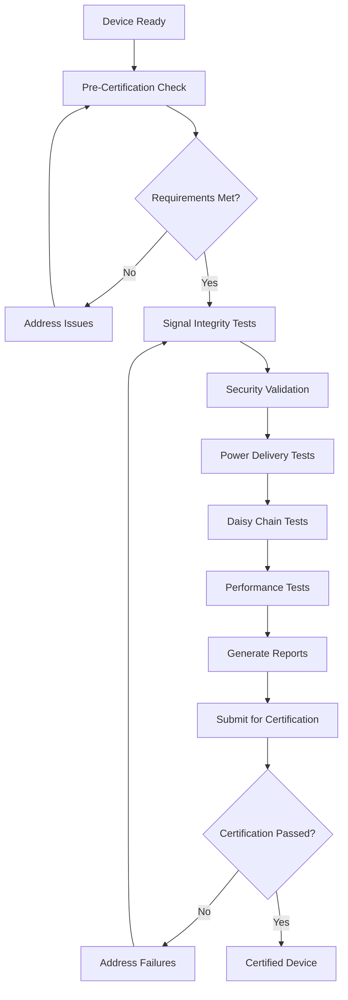

# USB4/Thunderbolt 4 Certification

This section provides comprehensive guidance for achieving USB4 compliance and Thunderbolt 4 certification.

## Certification Overview

### USB4 Compliance
USB4 compliance ensures your device meets the USB4 v2.0 specification requirements for signal integrity, protocol compliance, and interoperability.

### Thunderbolt 4 Certification
Thunderbolt 4 certification is Intel's premium certification program that ensures devices meet strict requirements for performance, security, and compatibility.

## Certification Guides

### [Thunderbolt 4 Certification Guide](thunderbolt4.md)
Complete step-by-step guide for achieving Thunderbolt 4 certification, including:
- Pre-certification requirements
- Signal integrity testing
- Security validation
- Power delivery testing
- Daisy chain validation
- Performance benchmarking
- Report generation

### [Intel Requirements](intel-requirements.md)
Official Intel certification requirements and specifications:
- Technical specifications
- Test procedures
- Compliance criteria
- Documentation requirements

### [Test Procedures](test-procedures.md)
Detailed test procedures for certification testing:
- Test setup and configuration
- Measurement procedures
- Pass/fail criteria
- Troubleshooting common issues

## Certification Workflow

## Quick Links

- **Start Here**: [Thunderbolt 4 Certification Guide](thunderbolt4.md)
- **Requirements**: [Intel Requirements](intel-requirements.md)
- **Testing**: [Test Procedures](test-procedures.md)
- **Examples**: Certification Examples
- **Troubleshooting**: Certification Issues

## Support

For certification support:
- Review the comprehensive guides above
- Check the troubleshooting section
- Contact Intel for official certification questions
- Reach out for professional certification consulting